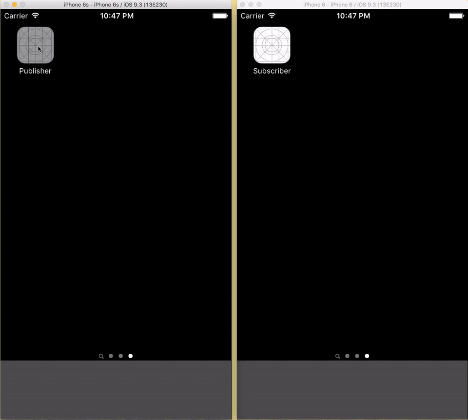

# iOS - Real time audience polling

A real time audience polling iOS application built on top of Firebase. As shown in the below animation, on the left side is the admin app which can send out the questions, check the results and see the online users. On the right side is the audience app which can watch the channels, read the published question and answer them.

## Implementation tutorial:
[Medium Post](https://medium.com/@prasad.pai/real-time-audience-polling-with-firebase-41f3854c37d5)

## Installation guide:
1. Clone or download the project. The pods are already installed and has been uploaded in the github.
2. Create your account in [Firebase](https://firebase.google.com).
3. Go to [console of Firebase](https://console.firebase.google.com) and click on Create New Project.
4. Give your project some name, select your region and click on Create Project.
5. Next, you will have to create iOS project. There will be two projects which needs to be created. One of Publisher and other of Subscriber.
6. Lets start with Publisher app. Click on iOS button with text of "Add Firebase to your iOS app". Give bundle identifier of "YMediaLabs.FirebaseAdsPublisher" and click on continue.
7. The `GoogleService-Info.plist` file should be automatically downloaded. Drag and drop this file into FirebaseAdsPublisher folder in XCode.
8. Step 3 and 4 of this walk through is already done for you.
9. Next, the procedure of step 6 and 7 will have to be repeated for Subscriber app. This time, give bundle identifier of "YMediaLabs.FirebaseAdsSubscriber" and drag and drop the `GoogleService-Info.plist` into FirebaseAdsSubscriber folder of XCode.
10. In order to access the database, authorization rules will have to be specified. We would like everyone to have read and write permissions without any authorization. For that, select Database from menu bar on left side and select sub-heading of RULES.
11. Delete the existing rules and paste the below rules. Click on Publish after changing.
~~~~
{
  "rules": {
    ".read": true,
    ".write": true
  }
}
~~~~
Build and run the project.
